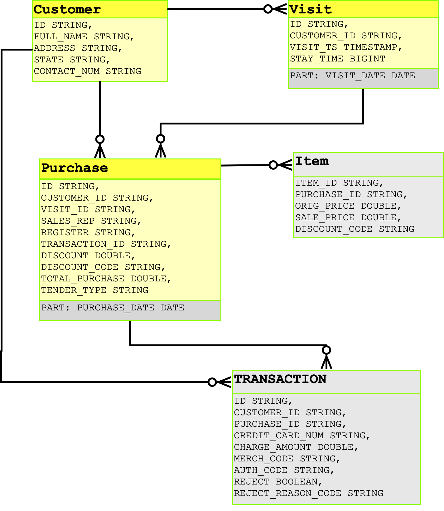

# Retail Use Case



## Sample Dataset

[Sample Dataset on Dropbox](https://www.dropbox.com/s/d8h421unl78mtlg/retail_data.zip?dl=0)

## Loading Data

The load process is broken down into source and target schema's.  Source being the raw dataset's as presented in the sample dataset above and the target dataset's in each technology.

There are a few script variables:
- TARGET_DB
- SRC_DB
- SPARK_DB
- HIVE_DB

### For Hive/Spark
```$sql
export ENV=hive
export VER=v1
export CMD_ALIAS='hive -c llap'

export ENV=spark
export CMD_ALIAS='spark-sql --num-executors 50'

export SRC_DB=${ENV}_retail
export TARGET_DB=${ENV}_${VER}_retail

# Setup Source Schema
${CMD_ALIAS} --hivevar SRC_DB=${SRC_DB} --hivevar TARGET_DB=${TARGET_DB} -i schema/${ENV}-init.sql -f schema/retail-schema-src.sql

# Setup Manage Table Schema
${CMD_ALIAS} --hivevar SRC_DB=${SRC_DB} --hivevar TARGET_DB=${TARGET_DB} -i schema/${ENV}-init.sql -f schema/${ENV}-retail-schema.sql

# Load with Good Load SQL
${CMD_ALIAS} --hivevar SRC_DB=${SRC_DB} --hivevar TARGET_DB=${TARGET_DB} -i schema/${ENV}-init.sql -f schema/${ENV}_${VER}-retail-load.sql

export VER=v2
export TARGET_DB=${ENV}_${VER}_retail

# Setup Manage Table Schema for Poor Load
${CMD_ALIAS} --hivevar SRC_DB=${SRC_DB} --hivevar TARGET_DB=${TARGET_DB} -i schema/${ENV}-init.sql -f schema/${ENV}-retail-schema.sql

# Load with Poor Load SQL
${CMD_ALIAS} --hivevar SRC_DB=${SRC_DB} --hivevar TARGET_DB=${TARGET_DB} -i schema/${ENV}-init.sql -f schema/${ENV}_${VER}-retail-load.sql

```

### Reset
```$sql
export ENV=hive
export CMD_ALIAS='hive -c llap'
export TARGET_DB=${ENV}_retail

${CMD_ALIAS} --hivevar TARGET_DB=${TARGET_DB} -f schema/drop.sql

export ENV=spark
export CMD_ALIAS='spark-sql'
export TARGET_DB=${ENV}_retail

${CMD_ALIAS} --hivevar TARGET_DB=${TARGET_DB} -f schema/drop.sql

```